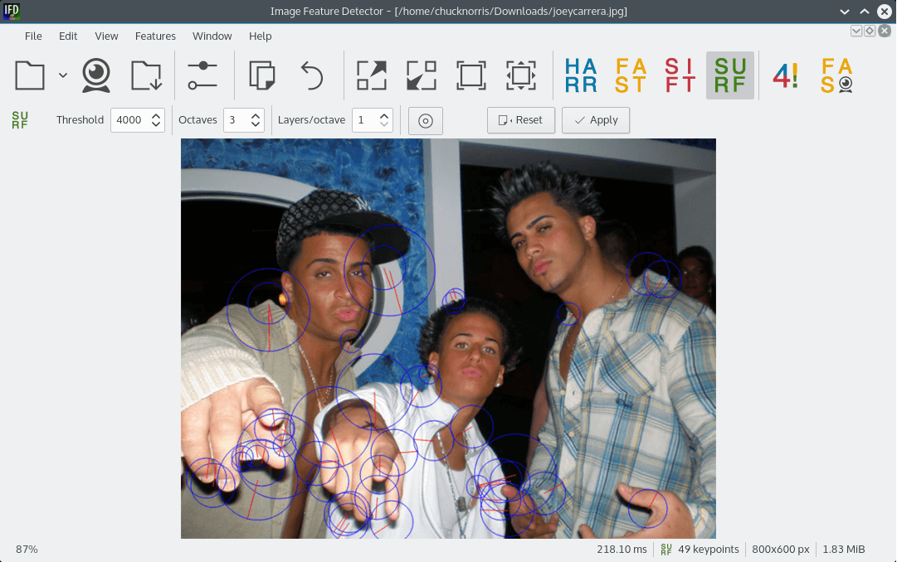
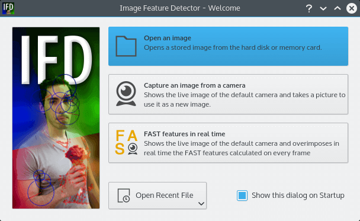
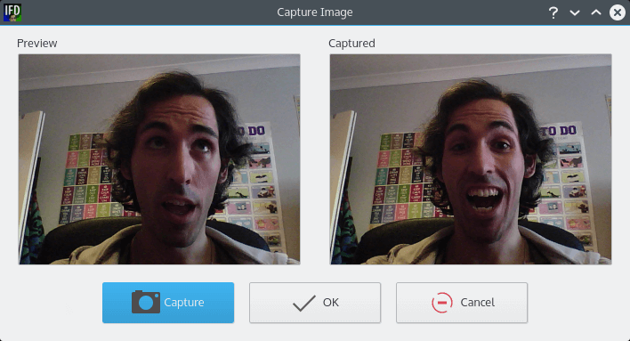
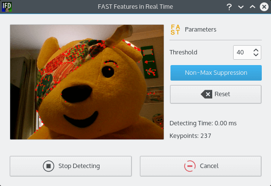
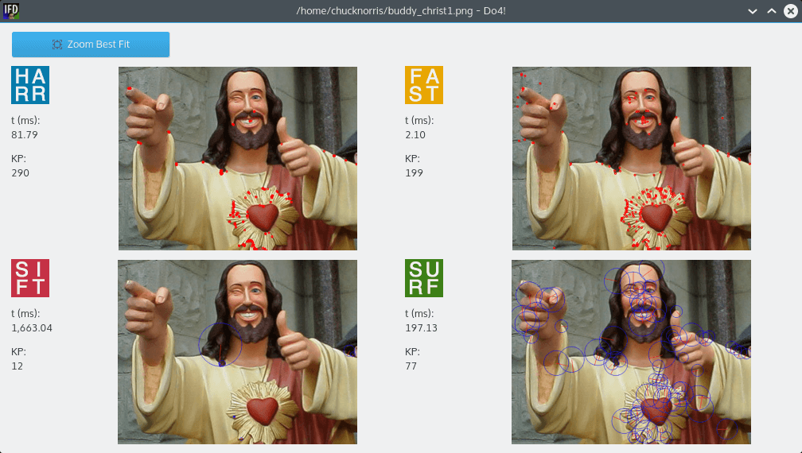

# Image Feature Detector

Image Feature Detector (IFD) is a desktop computer program with an intuitive graphic user interface aimed to calculate and show image features and descriptors obtained with some of the most usual [image feature detectors](https://en.wikipedia.org/wiki/Feature_detection_%28computer_vision%29) in computer vision: [Harris](https://en.wikipedia.org/wiki/Harris_affine_region_detector), [FAST](https://en.wikipedia.org/wiki/Features_from_accelerated_segment_test), [SIFT](https://en.wikipedia.org/wiki/Scale-invariant_feature_transform) and [SURF](https://en.wikipedia.org/wiki/Speeded_up_robust_features). It is programmed in C++ with the [Qt framework](http://qt.io). To calculate features IFD makes use of the [OpenCV libraries](http://opencv.org).



## Table of Contents

1. [Introduction](#introduction)
1. [Details](#details)
1. [Compiling the project](#compiling-the-project)

## Introduction


The project memory and presentation are available for download on PDF from the [doc folder](./doc). They are published under Creative Commons Attribution-Share Alike license. If you want to have a laugh and guess how terrible my English was just a few years ago these PDFs are the right material to find out.

The image detectors used in IFD have been the result of complex research projects. The papers which presented them to the scientific community are:

-  **Harris**: [A Combined Corner And Edge Detector](http://www.bmva.org/bmvc/1988/avc-88-023.pdf), by Chris Harris and Mike Stephens, [Roke Manor Research](http://roke.co.uk).
-  **FAST**: [Machine learning for high-speed corner detection](http://www.edwardrosten.com/work/fast.html), by Edward Rosten and Tom Drummond, [University of Cambridge](http://cam.ac.uk).
-  **SIFT**: [Distinctive Image Features from Scale-Invariant Keypoints](http://www.cs.ubc.ca/~lowe/papers/ijcv04.pdf), by David G. Lowe, [University of British Columbia](http://ubc.ca).
-  **SURF**: [SURF: Speeded Up Robust Features](http://www.vision.ee.ethz.ch/~surf/), by Herbert Bay, Andreas Ess, Tinne Tuytelaars and Luc Van Gool, [ETH Zurich](http://ethz.ch) and [K. U. Leuven](http://kuleuven.be).


## Details

The program let you choose an image stored on your computer and apply one of the four feature detectors. The obtained descriptors are overimposed in red on the image, and the number of them and the calculation time is shown on the status bar.



Pictures can be taken directly from a webcam within the program.



FAST features can be calculated in real time from the video stream of a webcam.



The input parameters for every detector can be tweaked from the _Detector parameters_ bar.

**Harris**


**FAST**


**SIFT**


**SURF**


All four detectors can be compared at the same time with the _Do4!_ option. A new window will pop up showing four images with a different detector applied to each picture. The parameter values of every detector are those ones set on each detector parameters bar.



The time shown only represents the time taken to calculate the features on an image which has already been prepared to be analised. That is it, it does not take into account the extra time needed to transform the images from 8U3C/8U4C (colour) to 8U1C (black and white, the detector's input requires an image on this format) and the time taken to paint the red circles showing the detected features. My guess™ is that it is a neglectable amount of time.


## Compiling the project

IFD is a simple C++ project. It only has 9 `cpp` classes, 8 `h` headers and 12 `ui` Qt GUI files. Once you have the dependencies solved compiling the code is a matter of seconds.

To configure the project building and binary linking IFD makes use of [CMake](https://cmake.org). Thanks to this IFD can be built on Linux, macOS and Windows. The screenshots shown here have been taken from a computer running Linux with KDE 5.

#### Resolving dependencies

IFD only makes use of two external libraries: Qt framework (v5) and OpenCV (v3):

- [Installing Qt](http://doc.qt.io/qt-5/linux.html): on Linux and Debian-based distributions you do not need to compile Qt. The easiest and fastest way to install Qt is with `apt-get`.
- [Installing OpenCV](http://opencv.org/): due to some OpenCV copyrighted code, the modules containing SIFT and SURF detectors aren't available on Debian repositories like the rest of [OpenCV modules](https://packages.debian.org/search?keywords=opencv). This means you will have to compile OpenCV libraries by yourself. By and large you will need to download the main [OpenCV modules](https://github.com/Itseez/opencv) plus the [OpenCV contrib](https://github.com/Itseez/opencv_contrib) ones (the code containing SIFT and SURF detectors), and when you are about to compile the main OpenCV modules set the `OPENCV_EXTRA_MODULES_PATH` CMake variable to `<opencv_contrib>/modules`. Better explained on the [OpenCV contrib repo](https://github.com/Itseez/opencv_contrib).

On Unix machines, once you have these two dependencies solved, from the shell run:

```
cd <imagefeaturedetector_root_folder>
mkdir CMakeFiles
cd CMakeFiles
cmake ..
make
```

and in a minute IFD should be compiled and ready to be executed in the `<imagefeaturedetector_root_folder>/bin` folder. `CMakeFiles` is an empty folder created to store the temporary files created by CMake so that IFD root folder remains clean.
